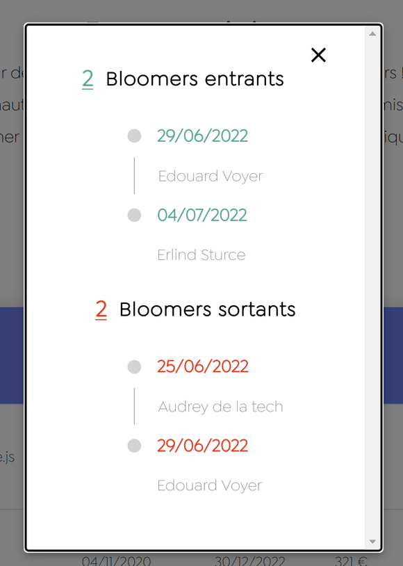

## Setting Up Environment Variables

This documentation will guide you on how to set up your application's environment variables by creating a `.env` file based on the `.env.example` file provided in the project repository.

### Step 1: Copy `.env.example`

Locate the `.env.example` file in the project repository and create a new file named `.env` in the same directory.

### Step 2: Obtain Airtable Access Token

To access data from your Airtable base, you need an access token with the `data.records:read` scope. Follow these steps to create the access token:

1. Log in to your Airtable account.
2. Click on your profile picture in the top right corner and select "Account."
3. Under the API section, click on the "Generate API Key" button.
4. Give your API key a descriptive name and select the `data.records:read` scope.
5. Click the "Save" button to create the key.

### Step 3: Find Base ID

To access your Airtable base, you need to know the Base ID. Follow these steps to find the Base ID:

1. Log in to your Airtable account.
2. Open the base you want to use in your application.
3. Click on the "Help" menu on the top right corner of the base.
4. Select "API documentation."
5. The Base ID will be displayed in the documentation.

### Step 4: Fill in `.env` Variables

In the `.env` file, fill in the `AIRTABLE_API_KEY` and `AIRTABLE_BASE_ID` variables with your access token and Base ID, respectively:

Example `.env` file:

```
AIRTABLE_API_KEY=your_airtable_access_token
AIRTABLE_BASE_ID=your_airtable_base_id
```

### Usage

Your application will automatically read the environment variables from the `.env` file during runtime. You don't need to manually load the variables; the application will do it automatically.

### Security Best Practices

Keep your `.env` file secure and never share it publicly or include it in your version control.

### Troubleshooting

If you encounter issues with your environment variables, double-check for any typos and ensure that the access token has the correct scope (`data.records:read`). Also, verify that the Base ID is correct.

Remember to refer back to this documentation whenever you need to set up the environment variables for your application.


### Launch
Open your terminal or command prompt, navigate to the directory containing the docker-compose.yml file, and run the following command to start the application:

```bash
docker-compose up --build
```

Docker Compose will build the Docker images for the backend and frontend based on the configurations in their respective Dockerfile files. It will also use the environment variables from the .env file to configure the services.

Once the containers are built and running, you can access the frontend application in your web browser at http://localhost. The backend will be available at http://localhost:3000.

That's it! You have successfully launched your application using Docker Compose.

Enjoy!


<hr/>

use Case technique
==================

Loïc Calvy

28 mars

v1.0.0

<br/>

#### Test technique Bloomays:

<span style="color:rgba(223, 84, 82, 1);fill:rgba(223, 84, 82, 1)">Temps mis à disposition: max 1 semaine</span>

👉 Utilisation de Reactjs obligatoire

👉 Utilisation d’Expressjs ou NestJS obligatoire

<br/>

#### Front :

👉 Reproduire le composant LeavingArrivingBloomers. en image ci-dessous.

Ce composant, regroupe deux types de freelances (bloomers). Les bloomers entrant et bloomers sortant. Dans le premier, nous y voyons les bloomers entrant à partir d’aujourd’hui jusqu'à la fin du mois prochain. Donc si nous sommes le 17 juin, tu verras les bloomers entrant du 17 juin au 31 juillet.

Même chose pour les bloomers sortant.

Pour ça nous nous appuyons sur les clées “beginDate” et “endDate” de l’objet mission



#### Back:

👉 Créer un server Express contenant une route renvoyant un tableau d’objet (Missions)

Voici la structure des données brut qui doivent être renvoyer par ta route:

```js
const missions = [
  {
    id: '',
    label: '',
    beginDate: '',
    endDate: '',
    missionType: '',
    freelance: {
      id: '',
      firstname: '',
      lastname: '',
      email: '',
    },
  },
// ...
];
```

#### Algo:

👉 Une fois les données reçues du back, il va falloir les manipuler pour avoir une structure permettant un affichage par date d’arrivée (pour les bloomers entrant) et par date de sortie (pour les bloomers sortant)

```js
const arriving = {
  '2020-09-18': [
    {
      firstname: 'Michel',
      lastname: 'Cacahuete',
      beginMission: '2020-09-18',
      endMission: '2021-09-18',
      id: 42,
    },
    {
      firstname: 'Sandy',
      lastname: 'Courgette',
      beginMission: '2020-09-18',
      endMission: '2021-09-18',
      id: 9,
    },
  ],
  '2020-10-18': [
    {
      firstname: 'Laura',
      lastname: 'Choux',
      beginMission: '2020-10-18',
      endMission: '2021-10-18',
      id: 16,
    },
  ]
};

const leaving = {
  '2021-07-18': [
    {
      firstname: 'Michel',
      lastname: 'Cacahuete',
      beginMission: '2020-02-18',
      endMission: '2021-07-18',
      id: 42,
    },
    {
      firstname: 'Sandy',
      lastname: 'Courgette',
      beginMission: '2020-09-03',
      endMission: '2021-07-18',
      id: 9,
    },
  ],
  '2021-10-18': [
    {
      firstname: 'Laura',
      lastname: 'Choux',
      beginMission: '2020-10-18',
      endMission: '2021-10-18',
      id: 16,
    },
  ]
};
```

Pour organiser les données reçue du back, créer une fonction classant les missions par date, de la courante à la plus lointaine dans le future.

#### Bonus:

**👉** Plutôt que de renvoyer du back de la data hardcodé, pourquoi ne pas tenter d’établir une connection avec [Airtable](https://airtable.com/api), d’y créer des tables, et de la requêter avec ton back ? :)

Bon chance!
